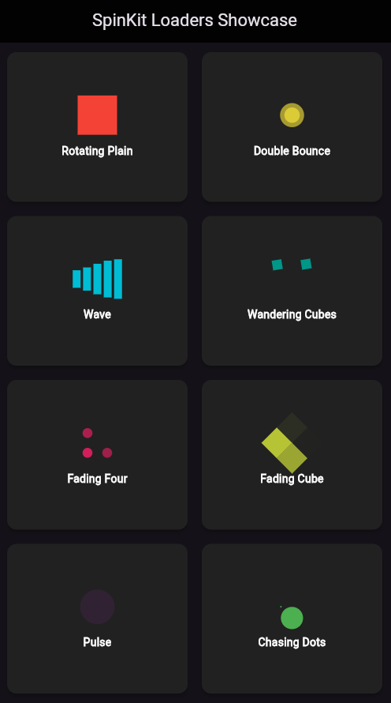

# Flutter SpinKit Loader Playground

A simple Flutter project showcasing various **SpinKit** loaders in a structured and interactive UI. This app helps developers preview different loading animations available in the `flutter_spinkit` package.

## 📸 Screenshot



## 📂 Project Structure

The project is organized into the following files:

- **`main.dart`** - The entry point of the Flutter application.
- **`home_screen.dart`** - Displays all loaders in a grid format.
- **`loader_card.dart`** - A reusable widget to display individual loaders.
- **`loaders.dart`** - Contains a list of loader widgets used in the app.

## 📦 Dependencies

Ensure you have the `flutter_spinkit` package installed in your `pubspec.yaml`:

```yaml
dependencies:
  flutter:
    sdk: flutter
  flutter_spinkit: ^5.2.0
